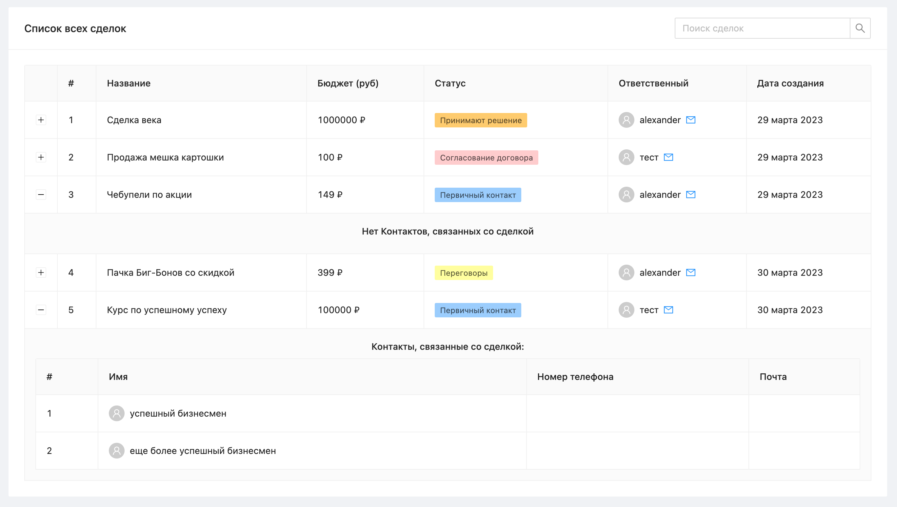

## Содержание

-   [1. Описание приложения](#1-описание-приложения)
-   [2. Интерфейс приложения](#2-интерфейс-приложения)
-   [3. Установка зависимостей и запуск проекта](#3-установка-зависимостей-и-запуск-проекта)
    -   [3.1. Установка зависимостей](#31-установка-зависимостей)
    -   [3.2. Запуск в режиме разработки](#32-запуск-в-режиме-разработки)
    -   [3.3. Сборка для прода](#33-сборка-для-прода)

## 1. Описание приложения

-   Приложение, использующее API-приложение, получающее список сделок из amoCRM
-   Вывод данных производится в таблицу
-   **Стек:** Vue 3 / Vuex / [Antd](https://www.antdv.com/)

## 2. Интерфейс приложения



Таблица содержит основную информацию обо всех сделках:

-   Название
-   Бюджет
-   Статус
-   Ответственное лицо
-   Дата создания

В первом столбце находится кнопка, раскрывающая список связанных с соответствующей сделкой контактов

## 3. Установка зависимостей и запуск проекта

Для запуска проекта необходимо:

-   Переименовать файл [.env.sample](./.env.sample) -> .env
-   В этом файле указать: **VUE_APP_BASE_URL** - URL к API-приложению (если запускать локально, то **http://localhost:3000/api**)

### 3.1. Установка зависимостей

```bash
npm install
```

### 3.2. Запуск приложения

```bash
# в режиме разработки
npm run serve

# Сборка для прода
npm run build
```
