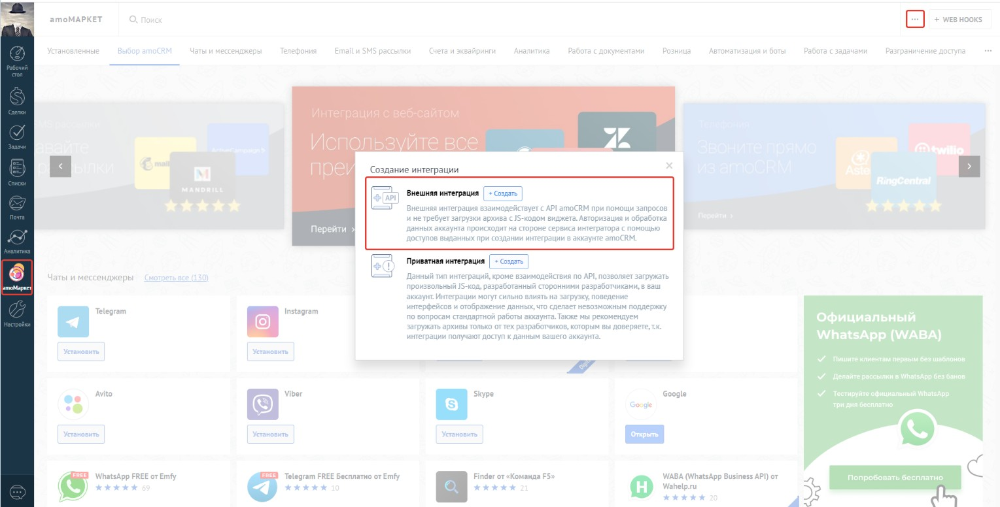
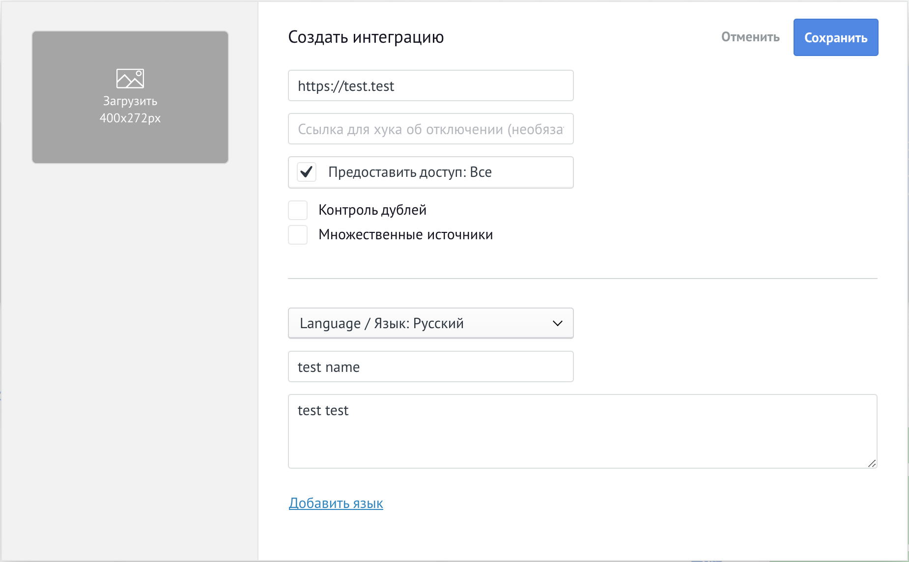
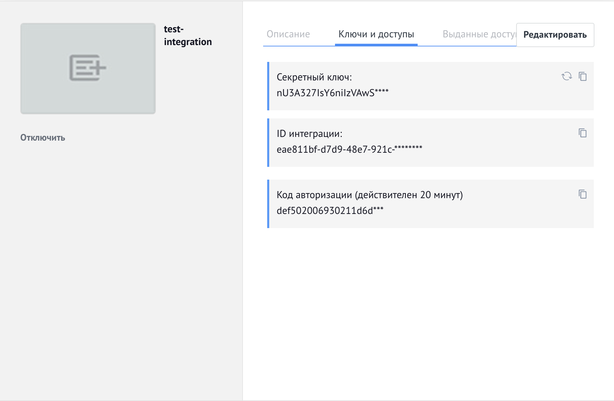

## Содержание

-   [1. Описание приложения](#1-описание-приложения)
-   [2. Запросы API](#2-запросы-api)
    -   [2.1. Получение всех сделок](#21-получение-всех-сделок)
-   [3. Настройка и запуск проекта](#3-настройка-и-запуск-проекта)
    -   [3.1. Подготовка к работе с приложением](#31-подготовка-к-работе-с-приложением)
    -   [3.2. Установка библиотек](#32-установка-библиотек)
    -   [3.3. Запуск приложения](#33-запуск-приложения)

## 1. Описание приложения

-   API-приложение, предоставляющее доступ к сделкам и их контактам amoCRM
-   **Стек:** NestJS

## 2. Запросы API

### 2.1. Получение всех сделок

```http
  GET /api/leads
```

| Параметр | Тип      | Описание                                            |
| :------- | :------- | :-------------------------------------------------- |
| `query`  | `string` | **Опциональный**. Запрос для фильтрации результатов |

## 3. Настройка и запуск проекта

### 3.1. Подготовка к работе с приложением

1. Первым шагом необходимо зарегистрировать аккаунт в системе [amoCRM](https://www.amocrm.ru/). Система позволяет создать демо-аккаунт, действующий 14 дней
2. Далее необходимо создать **интеграцию** в разделе **"amoМаркет"**
   
   В данной форме необходимо заполнить все обязательные поля (пример - на скриншоте ниже)  
   После заполнения нажать "Сохранить"
   
3. В том же разделе **"amoМаркет"** необходимо:

    - открыть вкладку "Установленные" (если вкладка не открылась автоматически после создания интеграции)
    - выбрать созданную интеграцию, чтобы открыть настройки интеграции
    - открыть вкладку "Ключи и доступы"

    

4. Переименовать файл [.env.sample](./.env.sample) в **.env**. В переименованом файле подставить нужные переменные:

-   **SUBDOMAIN** - Ваш поддомен в amoCRM, часть урла, идущая до '.amocrm.ru', например **https://[SUBDOMAIN].amocrm.ru/amo-market**

-   **CLIENT_ID**, **CLIENT_SECRET** и **AUTH_CODE** берутся из вкладки **"Ключи и доступы" (шаг 3)**.

-   **REDIRECT_URI** - Redirect URI, который вы указали при **создании интеграции (шаг 2)**. Можно посмотреть при нажатии на кнопку "Редактировать" в настройках интеграции.

При первом запуске приложения данные в **.env-файле** будут использованы для получения **токенов (access_token и refresh_token)**, с помощью которых в дальнейшем API-приложение сможет получать данные от amoCRM

Обратите внимание, что Код авторизации **AUTH_CODE** - временный, действует только 20 минут. Если вы не успеете получить токены за это время, вам нужно будет повторно открыть вкладку "Ключи и доступы" и получить новый код

### 3.2. Установка библиотек

```bash
$ npm install
```

### 3.3. Запуск приложения

```bash
# режим разработки
$ npm run start

# watch-режим ("горячая перезагрузка", обновление сервера при каждом изменении кода)
$ npm run start:dev

# production-режим
$ npm run start:prod
```
